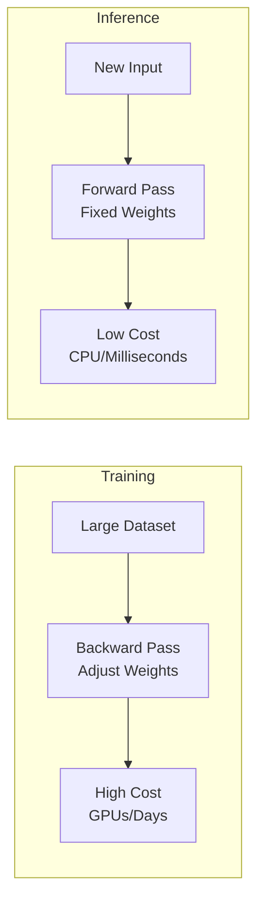
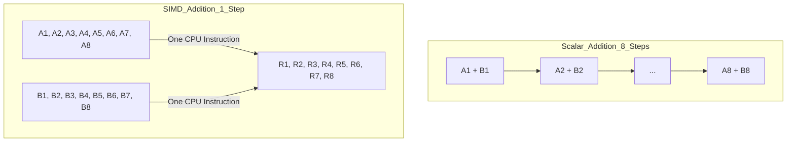
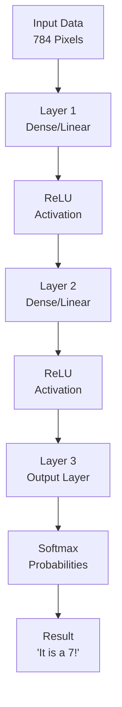

# Chapter 0: Project Overview — Building Your First AI Engine in C

Welcome to the world of high-performance AI! In this course, you aren't just using an AI library; you're **building one from scratch**.

Think of most AI developers as people who know how to drive a car. By the end of this journey, you’ll be the mechanic who knows exactly how the engine works, how the pistons move, and how to tune it for maximum speed.

---

## 0.1 What Is a Neural Network Inference Engine?

At its heart, a **neural network inference engine** is a piece of software that takes a "brain" (a pre-trained model) and uses it to make decisions or predictions on new information.

### The Recipe Analogy
*   **Training (The Chef's Research):** A chef spends months experimenting with ingredients, temperatures, and timing to create the perfect cake recipe. This is slow and expensive.
*   **Inference (The Bakery):** Once the recipe is written down, a bakery can make thousands of cakes quickly using those exact instructions. This is fast and efficient.

In our project, we are building the **Bakery**—the system that takes the "recipe" (weights and biases) and produces the "cake" (a prediction).

### Training vs. Inference: A Quick Look

| Aspect | Training | Inference (Our Engine) |
| :--- | :--- | :--- |
| **Goal** | Learning: Finding the best "rules" | Using: Applying those rules |
| **Operations** | Forward + Backward (Gradients) | Forward Pass ONLY |
| **Cost** | Very High (Days/Weeks) | Low (Milliseconds) |
| **Hardware** | Massive GPUs | CPUs, Phones, Edge Devices |

---

## 0.2 Why Are We Using C?

Most modern AI (like ChatGPT or Stable Diffusion) is written in Python on the surface, but the "engine" underneath is almost always **C or C++**. Here's why:

1.  **Ultimate Control:** C lets you decide exactly where every byte of data goes. In AI, we move millions of numbers; doing it efficiently saves massive amounts of time.
2.  **No "Hidden" Pauses:** Languages like Java or Python have "Garbage Collection" (automatic cleaning) that can pause your program unexpectedly. C runs at a steady, predictable speed.
3.  **Speaking to the Hardware:** We can use special "shortcuts" built into modern CPUs (like SIMD) that other languages often hide from you.
4.  **Portability:** A C engine can run on a toaster, a Tesla, or a supercomputer.

---

## 0.3 The Secret Sauce: What is SIMD?

**SIMD** stands for **Single Instruction, Multiple Data**. It is the reason modern AI is fast enough to be useful.

Imagine you have 8 numbers to add to another 8 numbers.
*   **Without SIMD (Scalar):** You add the first pair, then the second, then the third... taking 8 steps.
*   **With SIMD (Vector):** You put all 8 pairs in a "long tray" and the CPU adds them all in **one single step**.

We will implement this in Phase 5 to give our engine a **massive speed boost**.

---

## 0.4 The "Dictionary" of AI Terms

To speak "AI," you need to know these five concepts:

1.  **Tensor:** A fancy word for a list of numbers.
    *   0D Tensor = A single number (Scalar)
    *   1D Tensor = A list (Vector)
    *   2D Tensor = A grid (Matrix)
2.  **Weights & Biases:** These are the "knobs" of the neural network. Weights decide how much an input matters, and Biases help the network adjust its "starting point."
3.  **Layer:** A group of "neurons" that process data together. Think of it as one step in a factory assembly line.
4.  **Activation Function:** A math filter (like ReLU) that decides if a neuron's signal is "strong enough" to pass to the next layer.
5.  **Forward Pass:** The journey data takes from the input (like image pixels) to the output (like the word "Cat").

---

## 0.5 The Big Picture: How Data Flows

Here is how our engine will actually process an image:

---

## 0.6 Common C Mistakes (And How We Avoid Them)

Since we are using C, we have to be careful. Here are the "Landmines" we'll watch out for:

### 1. Memory Leaks (The "Messy Room")
If you ask for memory (`malloc`), you **must** give it back (`free`).
*   **WRONG:** Creating a matrix and never deleting it. Your computer will eventually run out of RAM and crash.
*   **RIGHT:** Every `matrix_create` will have a matching `matrix_free`.

### 2. Buffer Overflows (The "Small Box")
*   **WRONG:** Trying to put 10 numbers into a list meant for 5.
*   **RIGHT:** We will carefully track the "Rows" and "Columns" of every matrix to make sure we never go out of bounds.

### 3. Ignoring Errors
*   **WRONG:** Assuming the computer always has enough memory.
*   **RIGHT:** We will always check if our memory requests were successful before using them.

---

## 0.7 Our Roadmap

We will build this engine in 5 clear phases:
1.  **Phase 1: Memory & Tensors** (The Foundation)
2.  **Phase 2: Matrix Math** (The Muscles)
3.  **Phase 3: Layers & Logic** (The Brain)
4.  **Phase 4: Saving & Loading** (The Memory)
5.  **Phase 5: Speed & Optimization** (The Turbocharger)

Let’s get started with **Chapter 1: Memory & Pointers!** 🚀
