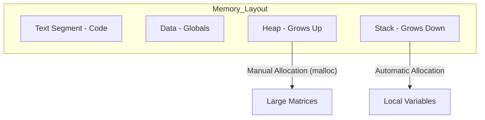
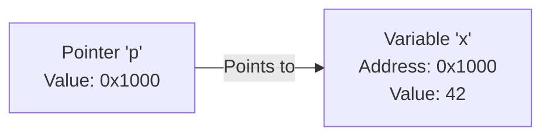
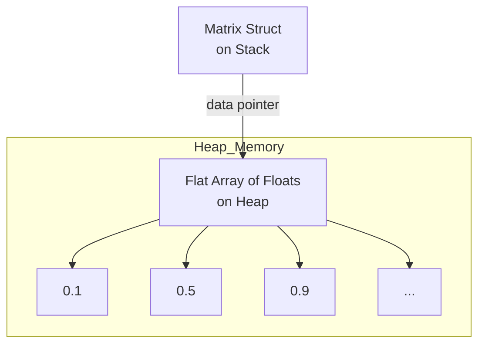

# Chapter 1: C Memory and Pointers — The Foundation of AI

To build a high-performance AI engine, we need to understand exactly how the computer stores data. In C, you are in charge of the memory. This chapter will teach you how to handle it like a pro.

---

## 1.1 The C Memory Model: Stack vs. Heap

Imagine your computer's memory as a large library.

### The Stack (The Desk)
The **Stack** is like your personal desk. It's fast and easy to reach, but it has very little space. When you finish a task (exit a function), the desk is automatically cleared.

### The Heap (The Warehouse)
The **Heap** is like a massive warehouse. You can store huge amounts of data there, but you have to specifically ask for space, and you **must** tell the warehouse when you're done with it.



| Feature | Stack (Desk) | Heap (Warehouse) |
| :--- | :--- | :--- |
| **Speed** | Extremely Fast | Slower |
| **Size** | Very Small (MBs) | Huge (GBs of RAM) |
| **Cleanup** | Automatic | Manual (`free`) |
| **Best For** | Temporary numbers | Giant Neural Network Weights |

---

## 1.2 Pointers: Where Is My Data?

A **pointer** is just a variable that holds a **memory address**. Think of it as a GPS coordinate or a house address.

```c
int x = 42;    // The value is 42
int* p = &x;   // 'p' points to the address of 'x'
```

### Visualizing Pointers



### Why Do We Need Them?
Imagine you have a giant matrix with 1 million numbers. If you want to give it to a function:
*   **Without Pointers:** The computer has to copy all 1 million numbers (very slow!).
*   **With Pointers:** You just give the function the **address** of the matrix (instant!).

---

## 1.3 Our "Matrix" Structure

In this project, we store our AI data in a custom `Matrix` structure.

```c
typedef struct {
    float* data;   // Pointer to the actual numbers on the Heap
    int rows;      // How many rows
    int cols;      // How many columns
    int stride;    // For advanced memory tricks (explained later)
} Matrix;
```

### How a Matrix Lives in Memory



---

## 1.4 Flat Arrays: Why 1D beats 2D

You might think a 2D matrix should be stored as an "array of arrays." However, for AI, we use **Flat Arrays** (one long line of numbers).

### The "Book" Analogy
*   **2D Array:** Like a bookshelf where each shelf is a separate piece of wood.
*   **Flat Array:** Like one long scroll where you just know that every 10 inches marks a new "page."

**Why use Flat Arrays?**
1.  **Speed:** The CPU is much faster at reading data in a straight line (this is called "Cache Locality").
2.  **Simplicity:** It’s much easier to send one big block of data to the GPU or a SIMD unit.

---

## 1.5 Common Memory Bugs (The "Danger Zone")

Since C doesn't clean up after you, you need to watch out for these three bugs:

### 1. The Memory Leak
You use `malloc` to get space in the warehouse, but you never return the key.
*   **Result:** Your computer runs out of memory and crashes.
*   **Fix:** Always call `free(matrix->data)`!

### 2. Use-After-Free
You return the warehouse key, but then you try to go back inside.
*   **Result:** Weird crashes or wrong numbers.
*   **Fix:** Set your pointer to `NULL` after you `free` it.

### 3. Buffer Overflow
You have a box for 10 eggs, but you try to put the 11th egg in anyway.
*   **Result:** You crush the other eggs (corrupt other data).
*   **Fix:** Always check your `rows` and `cols` before writing.

---

## 1.6 Weight Initialization (Xavier/He)

When we first create a Neural Network, we can't just set all the weights to zero. If we do, the network will never learn!

We use **Xavier Initialization**. It's a fancy way of picking random numbers that aren't too big and aren't too small. This keeps the signals "healthy" as they flow through the brain.

```c
// Mathematical Intuition:
// We want the variance of the input to match the variance of the output.
float scale = sqrtf(2.0f / (fan_in + fan_out));
```

---

## Summary

- **Stack** is for small, fast things. **Heap** is for big, permanent things.
- **Pointers** are addresses that let us share data without copying it.
- **Matrices** are stored as flat lines of numbers on the Heap for maximum speed.
- **Memory Management** is our responsibility—we must `malloc` and `free` correctly.

Now that we have a place to store our numbers, let's learn how to do math with them in **Chapter 2!** 🚀
