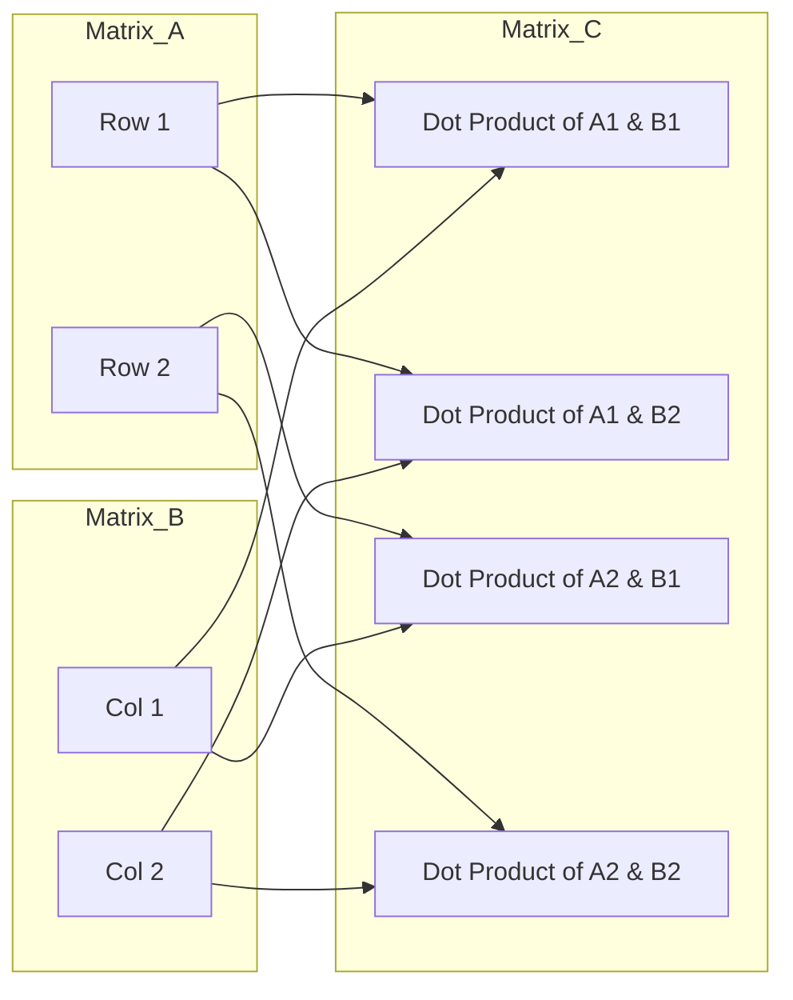
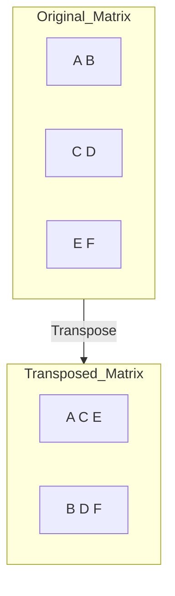

# Chapter 2: Matrix Math in C — The "Muscles" of AI

In the last chapter, we built the "bones" (Memory & Matrices). Now, it's time to build the "muscles"—the math that actually powers every neural network.

---

## 2.1 Why Matrix Math Powers AI?

Matrix math is the **engine** of every AI. Whether it's ChatGPT, Stable Diffusion, or a simple hand-writing recognizer, it's all just matrix multiplications under the hood.

### The Big Idea
Each "layer" of an AI is basically just one matrix multiplication:
`Output = Weights × Input + Bias`

If we can make this **one** step very fast, our whole AI becomes very fast.

---

## 2.2 Matrix Multiplication: The Core Operation

Matrix multiplication isn't like normal multiplication. You don't just multiply the numbers in the same spots.

Instead, you take a **row** from the first matrix and a **column** from the second matrix, and you do a "Dot Product" (multiply and add them all up).



### The Complexity: O(n³)
If you have a 100x100 matrix:
*   You have **100 rows** to process.
*   For each row, you have **100 columns**.
*   For each spot, you do **100 multiplications**.
*   **Total:** 1,000,000 operations!
As you double the size of the matrix, the work increases by **8 times**! This is why optimization is so important.

---

## 2.3 The "Dot Product": A Deep Dive

The **Dot Product** is the fundamental unit of all AI math. It’s like a "weighted sum."

```c
// Example: Dot Product of [1, 2, 3] and [4, 5, 6]
float result = (1 * 4) + (2 * 5) + (3 * 6); // 4 + 10 + 18 = 32
```

In a neural network, the dot product represents one "neuron" listening to all its inputs and deciding how strong the signal is.

---

## 2.4 Cache Locality: The Secret to Speed

Your computer's CPU is much faster than its RAM. To keep the CPU busy, we must store data in a way that’s easy to read in a straight line. This is called **Cache Locality**.

### The "Shopping" Analogy
*   **Good Locality (Row-Major):** Buying everything on your list in the order you find them in the aisles. You walk in one straight line through the store.
*   **Bad Locality (Column-Major):** Buying one item, then running to the back of the store, then back to the front for the next item. You waste all your time walking!

### In Our Code:
We use a specific "Loop Order" (i-k-j) that ensures we are always reading numbers that are next to each other in memory.

---

## 2.5 Transposing: Flipping the Script

Sometimes, we need to flip a matrix (turn its rows into columns). This is called **Transposing**.



**Why do we need this?**
During certain AI steps (like "Backpropagation"), we need to use the weights in reverse. Transposing lets us do that efficiently.

---

## 2.6 Unit Testing: How to Know You’re Right

Floating-point math in C can be tricky. You can’t just say `if (a == b)`. You have to say `if (abs(a - b) < 0.0001)`.

We built a **test suite** to make sure our math is 100% correct. We test:
1.  **Identity:** Multiplying by a "1" matrix should give you the same result.
2.  **Zero:** Multiplying by a "0" matrix should give you all zeros.
3.  **Transpose:** Flipping a matrix twice should bring it back to the start.

---

## Summary

- **Matrix Multiplication** is the engine of AI, but it's very "expensive" (O(n³)).
- **Dot Products** are the heart of every single neuron.
- **Cache Locality** is why we store matrices in "Flat Arrays" (one long line).
- **Transposing** is flipping rows and columns, used for training and advanced layers.

Next up, we’ll learn about **Activation Functions**—the "filters" that decide what data gets through! 🚀
