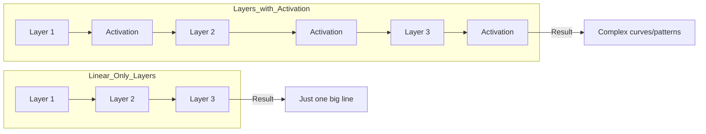
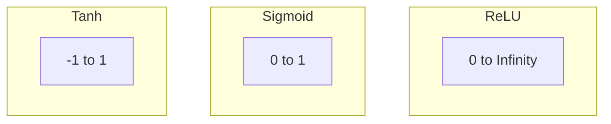

# Chapter 3: Activation Functions — The "Filters" of AI

In the last chapter, we built the "Muscles" (Matrix Math). Now, we need the "Filters"—the **Activation Functions**.

Without these filters, a neural network is just a very big calculator. With them, it can learn how to recognize cats, cars, and human speech!

---

## 3.1 The "Linear Collapse" Problem: Why We Need Filters

Imagine you have two layers of a neural network:
*   Layer 1: Multiply input by 2.
*   Layer 2: Multiply input by 3.

You could just replace both layers with one layer that multiplies by **6**. No matter how many "linear" layers you stack, they all "collapse" into one single layer.

### The Math Analogy
*   Linear: `f(x) = 2x`, `g(x) = 3x` → `f(g(x)) = 6x` (Still a line)
*   Non-Linear: `f(x) = max(0, x)` → `f(g(x))` (Now it can have "corners" and "curves")



**Non-linear filters** (Activation Functions) allow the network to learn complex shapes. This is called the **Universal Approximation Theorem**.

---

## 3.2 ReLU: The Champion

**ReLU** stands for **Rectified Linear Unit**. It is the most popular activation function in modern AI.

```c
// ReLU Logic:
if (x < 0) return 0;
else return x;
```

### Why use ReLU?
1.  **Fast:** No complex math. Just a quick "if" statement.
2.  **Sparsity:** Half the neurons are turned "off" (0). This makes the network more efficient.
3.  **No Vanishing Gradients:** It doesn't "squash" the signal too much, which helps with deep networks.

---

## 3.3 Sigmoid and Tanh: The Old Guard

Before ReLU, everyone used **Sigmoid** or **Tanh**.

### Sigmoid
It "squashes" any number into a range between **0** and **1**.
*   **Good for:** Predicting "Yes/No" (Probabilities).
*   **Bad for:** Deep networks (it makes the signals too small too quickly).

### Tanh
It "squashes" any number into a range between **-1** and **1**.
*   **Good for:** Keeping the signals "centered" around zero.
*   **Bad for:** Still has the "squishing" problem (vanishing gradients).



---

## 3.4 Softmax: The Final Word

**Softmax** is special. It's usually only used at the very **end** of the network.

Imagine our AI is trying to decide if an image is a Cat, Dog, or Bird. It gives us three "scores":
*   Cat: 10
*   Dog: 2
*   Bird: -1

Softmax turns these scores into **probabilities** that add up to 100%:
*   Cat: 98%
*   Dog: 1.5%
*   Bird: 0.5%

---

## 3.5 Function Pointers in C

How do we let our code switch between ReLU, Sigmoid, and Tanh easily? We use **Function Pointers**.

Instead of writing a giant "if-else" statement, we store the address of the math function in a variable. It’s like having a "Plugin" system for your AI layers.

```c
typedef void (*ActivationFn)(Matrix*, Matrix*);

// Now we can use it like this:
ActivationFn my_filter = activation_relu;
my_filter(input, output);
```

---

## 3.6 Numerical Stability (The "Don’t Crash" Rule)

When we do the math for Softmax, we have to calculate `e` (2.718...) to the power of our scores.
*   If the score is 1,000, `e^1000` is so big it will **crash your computer**.

**The Fix:** We subtract the biggest score from every score first. This is a common trick in AI engineering that keeps the math "stable" and safe.

---

## Summary

- **Activation Functions** are "filters" that make the network "smart" and non-linear.
- **ReLU** is the fastest and most common (it just cuts off negative numbers).
- **Sigmoid** and **Tanh** "squash" numbers into small ranges (0-1 or -1 to 1).
- **Softmax** is for the final layer; it turns scores into probabilities.
- **Function Pointers** let us swap these filters in and out of our AI layers.

Next, we’ll see how all this math comes together in the **Forward Pass!** 🚀
