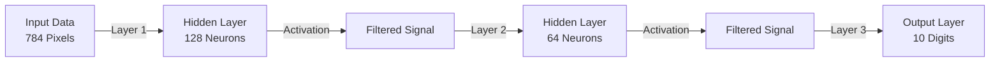
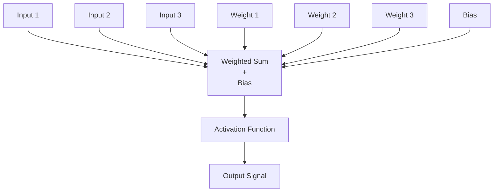

# Chapter 4: Forward Pass — The "Journey" of Data

Now that we have the "Muscles" (Math) and "Filters" (Activation), let's build the **Journey**. This is how an input (like an image) travels through the brain of our AI to get a result.

---

## 4.1 What Is a Forward Pass?

A **Forward Pass** is just a chain of calculations. It takes your input (the "Question") and gives you the "Answer."



### Why "Forward"?
Because data only moves in one direction: from **Input** to **Output**. (The opposite is "Backward Pass," which is used when training the AI).

---

## 4.2 The "Neuron": AI's Smallest Unit

An AI is just thousands of these tiny "Neurons" working together.



### The Math of a Single Neuron:
`Signal = Activation( (Input1 × Weight1) + (Input2 × Weight2) + ... + Bias )`

---

## 4.3 Weights and Biases: The "Knobs" of AI

Imagine you are trying to guess if a person is "Tall" based on their "Weight."
*   **Weights:** How much does their weight matter? (Very much? A little bit?)
*   **Bias:** What's the starting height? (Start at 0? Or start at 100cm?)

### Why do we need the Bias?
Without a bias, if all your inputs are 0, your output will **always** be 0.
*   **Without Bias:** Every line must go through (0,0).
*   **With Bias:** You can move your line anywhere. This lets the AI be much more flexible.

---

## 4.4 Shape Math: The "LEGO" Rule

For two layers to connect, the **Output** of the first must be the same size as the **Input** of the second.

### Example:
*   Layer 1: Input (784) → Output (128)
*   Layer 2: Input (128) → Output (64)
*   **This works!** (128 matches 128)

*   Layer 1: Input (784) → Output (256)
*   Layer 2: Input (128) → Output (64)
*   **This CRASHES!** (256 does not match 128)

We built a **Shape Validator** into our code to catch these mistakes before they happen.

---

## 4.5 The "Dense Layer" Implementation

In our C code, we store everything a layer needs in a `DenseLayer` struct.

```c
typedef struct {
    Matrix* weights;        // The "importance" of each input
    Matrix* biases;         // The "offset" for each neuron
    Matrix* output;         // Where we store the result
    ActivationFn activation; // Which filter to use (ReLU, Softmax, etc.)
} DenseLayer;
```

---

## 4.6 Trace-Through: A Real Example

Let’s trace one simple input through a 2-neuron layer:
1.  **Input:** [1.0, 2.0]
2.  **Weights:** [[1, 2], [3, 4]]
3.  **Biases:** [0.5, 0.5]
4.  **Activation:** ReLU

### Step 1: Weighted Sum
*   Neuron 1: (1.0 × 1) + (2.0 × 2) + 0.5 = **5.5**
*   Neuron 2: (1.0 × 3) + (2.0 × 4) + 0.5 = **11.5**

### Step 2: Activation
*   ReLU(5.5) = **5.5**
*   ReLU(11.5) = **11.5**

**Result:** [5.5, 11.5]

---

## 4.7 Memory Management (The "Cleanup" Crew)

Every time we create a layer, we are using **Heap memory** (the Warehouse). When we are finished with our AI, we have to clean it up.

```c
void dense_layer_free(DenseLayer* layer) {
    matrix_free(layer->weights);
    matrix_free(layer->biases);
    matrix_free(layer->output);
    free(layer);
}
```

---

## Summary

- **Forward Pass** is the data's journey from input to output.
- **Weights** decide which inputs are important; **Biases** give the AI a "starting point."
- **Shape Math** ensures that layers can "fit together" like LEGO blocks.
- **Dense Layers** are the most common type of AI layer—every input is connected to every output.
- **Memory Cleanup** is essential when you're finished.

Next, we’ll see how to stack these layers to build a **Full Neural Network!** 🚀
