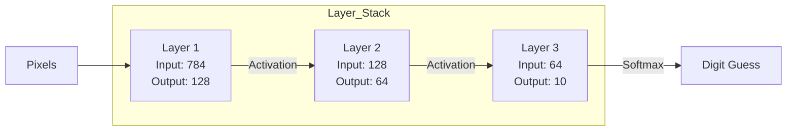
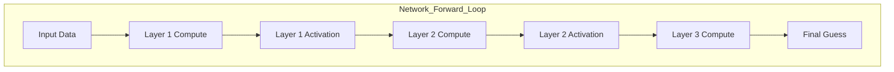

# Chapter 5: Network Architecture — The "Brain" of AI

In the last chapter, we built the "Muscles" (Math) and "Filters" (Activation). Now, it's time to build the **Brain**—the `NeuralNetwork` container that connects all the layers together.

---

## 5.1 Stacking Layers: The "Deep" in Deep Learning

Why is it called "Deep Learning"? Because we stack multiple layers on top of each other. Each layer transforms the input in a new way, allowing the AI to learn increasingly complex features.



### Why More Layers?
*   **1 Layer (Linear):** Can only learn "straight lines" (Yes/No).
*   **2-3 Layers:** Can learn "curves" (Shapes).
*   **10+ Layers (Deep):** Can learn "concepts" (Faces, Language, Art).

---

## 5.2 Dynamic Arrays in C: Growing Your AI

When we build a network, we don't always know how many layers it will have. In C, we use `realloc` to "grow" our array of layers.

### The "Socks" Analogy
*   **Static Array:** A drawer that only fits 5 pairs of socks.
*   **realloc:** Getting a new, bigger drawer and moving all your socks over automatically.

**The Rule of 2:** Often, we double the size of the array whenever it gets full to avoid resizing too often.

```c
// realloc logic:
DenseLayer** new_layers = realloc(net->layers, new_size);
if (new_layers != NULL) {
    net->layers = new_layers;
}
```

---

## 5.3 Chaining Layers: The Output-to-Input Flow

The output of Layer 1 becomes the input for Layer 2. Our `NeuralNetwork` handles this "hand-off" automatically.



### Shape Validator:
Before adding a layer, our code checks if its **Input size** matches the **Output size** of the previous layer. If they don't match, the network won't let you add it.

---

## 5.4 Parameter Counting: How Big Is Your AI?

Every "connection" in the network is a weight that the computer has to store.

### Example: Our MNIST Network (784 → 128 → 64 → 10)
*   Layer 1: (784 × 128) + 128 biases = **100,480**
*   Layer 2: (128 × 64) + 64 biases = **8,256**
*   Layer 3: (64 × 10) + 10 biases = **650**
*   **Total Parameters:** **109,386**

That’s over 100,000 numbers the computer has to store and multiply! (A model like LLaMA-3 has **70 billion** parameters!)

---

## 5.5 Argmax: Making a Prediction

After the final layer (Softmax), the network gives us 10 probabilities:
*   [0.01, 0.05, 0.88, 0.02, 0.04, ...]

Which digit is it? The one with the highest number! This is called **Argmax**.

```c
// Argmax Logic:
int best_digit = 0;
float max_score = output->data[0];
for (int i = 1; i < 10; i++) {
    if (output->data[i] > max_score) {
        max_score = output->data[i];
        best_digit = i;
    }
}
```

---

## 5.6 Case Study: The MNIST Digit Recognizer

MNIST is the "Hello World" of AI. It’s a collection of 70,000 hand-drawn digits (0-9).

*   **Input:** 28x28 pixel image (784 pixels total).
*   **Output:** 10 digits (0, 1, 2, ..., 9).

Our network takes those 784 pixels and "distills" them through 128 neurons, then 64 neurons, until it finally reaches a single number (the digit).

---

## Summary

- **NeuralNetwork** is the container that stacks layers together.
- **Deep Learning** is just stacking many layers to learn complex patterns.
- **realloc** lets our network grow as we add more layers.
- **Shape Validator** ensures the output of one layer "fits" into the next.
- **Argmax** is how we pick the "winner" from the final probabilities.

Next, we’ll learn how to **Save and Load** our AI models to a file! 🚀
