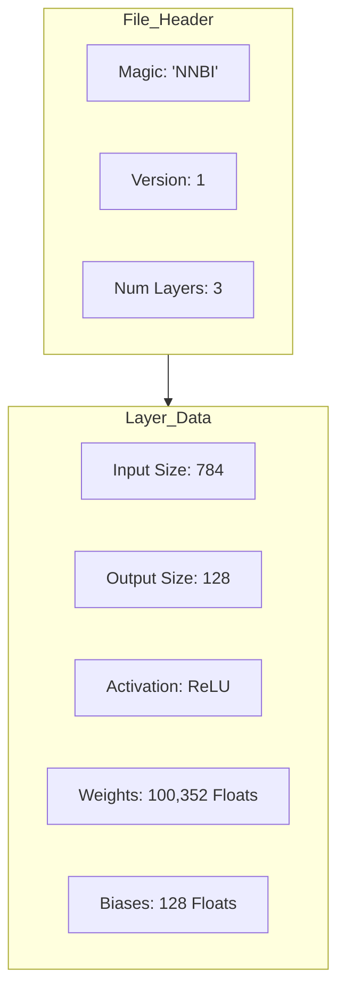

# Chapter 6: Model File Formats — The "Memory" of AI

In the last chapter, we built the "Brain" (Network). Now, we need the **Memory**—how we save our AI to a file and load it back later.

---

## 6.1 Why Save to a File?

Training an AI can take days or weeks. Once it's trained, you don't want to lose those weights! You need a way to store them on your disk.

### The Training vs Inference Separator
*   **Training (The School):** A big computer learns from millions of images (takes a long time).
*   **Inference (The Job):** Your AI uses the "lesson" to make a quick guess (takes milliseconds).

By saving our model to a file, we can train it once and use it everywhere!

---

## 6.2 Binary vs Text: Why We Use Binary

When we save data to a file, we have two choices:
1.  **Text (JSON/CSV):** Easy for humans to read, but very large and slow.
2.  **Binary (.nnbin):** Impossible for humans to read, but very small and fast for the computer.

### The "Recipe" Analogy
*   **Text:** Writing out "One zero zero point zero zero zero one..." (Slow to read).
*   **Binary:** Just storing the raw numbers (Instant to read).

---

## 6.3 Our Custom `.nnbin` Format

We designed a simple "Header" for our files so the computer knows it's an AI model.



### Why the "Magic Number"?
Imagine you try to open a photo in a word processor. It won't work. The "Magic Number" (`NNBI`) tells our program: "This is definitely an AI model, not a cat photo."

---

## 6.4 `fread` and `fwrite`: Direct Communication

In C, we use `fwrite` to dump our numbers from RAM directly onto the disk. It’s like pouring water from a bucket (RAM) into a bottle (File).

```c
// Saving weights to a file:
fwrite(layer->weights->data, sizeof(float), layer->weights->rows * layer->weights->cols, file);
```

---

## 6.5 Endianness: The "Left-to-Right" Problem

Different computers read numbers in different orders (Left-to-Right vs Right-to-Left). This is called **Endianness**.
*   **Little-Endian:** Most modern computers (Intel, Apple Silicon).
*   **Big-Endian:** Older or specialized computers.

If you save a model on one and load it on the other, your numbers will be total gibberish! We assume Little-Endian for this project since it's the standard today.

---

## 6.6 The GGUF Format: How Llama Works

If you use AI like Llama-3 or Mistral, they use a format called **GGUF**. It's just like our `.nnbin` but much more complex.
*   **Metadata:** Stores the name of the AI, who made it, and how it was trained.
*   **Quantization:** Stores weights in smaller sizes to save memory.

---

## 6.7 Quantization: Shrinking the Brain

A giant AI model can be **hundreds of gigabytes**. How do we fit it onto a phone? We use **Quantization**.

### The "Rounding" Analogy
*   **Full Precision (Float32):** 0.123456789 (Very accurate, uses 4 bytes).
*   **Quantized (Int8):** 0.12 (Good enough, uses 1 byte).

By rounding our numbers, we can make an AI **4 times smaller** with only a tiny loss in accuracy!

---

## Summary

- **Model Files** allow us to save our trained weights for later use.
- **Binary (.nnbin)** is the standard choice for storing millions of AI weights.
- **Magic Numbers** ensure we don't try to load the wrong file type.
- **Endianness** is the order in which a computer reads bytes (Little-Endian is standard).
- **Quantization** is the process of rounding numbers to make an AI model smaller.

Next, we’ll see how to make our AI **insanely fast** using **SIMD!** 🚀
