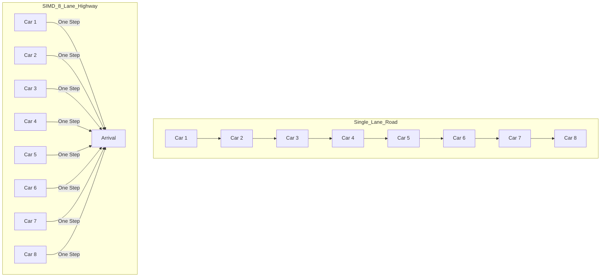
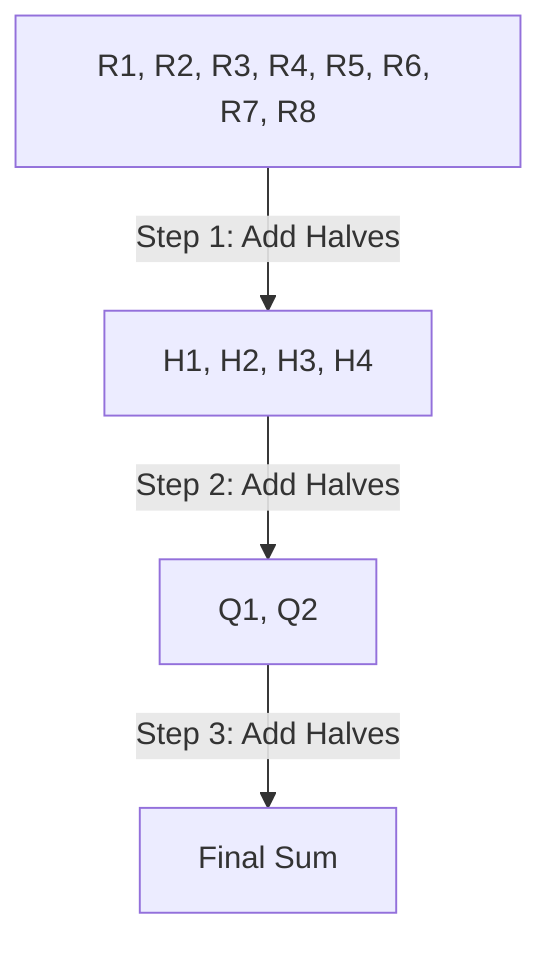

# Chapter 7: SIMD Optimizations — The "Turbo" for AI

In the last chapter, we built the "Memory" (File Formats). Now, we're going to make our AI **8 times faster** with a technology called **SIMD**.

---

## 7.1 What Is SIMD?

**SIMD** stands for **Single Instruction, Multiple Data**.

Think of it like an **8-lane highway** instead of a single-lane road.



### The CPU Register
Normally, a CPU works on one number at a time (32 bits). With **AVX2**, the CPU works on **8 numbers at once** (256 bits).

---

## 7.2 AVX2 Intrinsics: The Special Codes

To use SIMD, we have to use special functions in C called **Intrinsics**. These are like "magic spells" that tell the CPU exactly what to do.

### The "Shopping List" of Intrinsics
1.  **`_mm256_loadu_ps`**: Pick up 8 numbers from RAM and put them in a vector.
2.  **`_mm256_mul_ps`**: Multiply 8 numbers by 8 other numbers (in one step!).
3.  **`_mm256_add_ps`**: Add 8 numbers together.
4.  **`_mm256_set1_ps`**: Copy one number 8 times to fill a whole vector.

---

## 7.3 How to Write SIMD Code

Instead of a normal loop that goes through one by one, we write a loop that goes through **8 by 8**.

```c
// Normal Loop:
for (int i = 0; i < n; i++) {
    result[i] = a[i] * b[i];
}

// SIMD Loop:
for (int i = 0; i < n; i += 8) {
    __m256 a_vec = _mm256_loadu_ps(a + i); // Load 8
    __m256 b_vec = _mm256_loadu_ps(b + i); // Load 8
    __m256 prod = _mm256_mul_ps(a_vec, b_vec); // Multiply 8
    _mm256_storeu_ps(result + i, prod); // Save 8
}
```

---

## 7.4 The Horizontal Sum: Adding It All Up

After we multiply 8 pairs of numbers, we have one "Tray" (Vector) with 8 results:
`[R1, R2, R3, R4, R5, R6, R7, R8]`

To get a single **Dot Product**, we need to add these 8 numbers together. This is called a **Horizontal Sum**. It’s like folding a piece of paper in half three times until you have only one square.



---

## 7.5 Benchmarking: The Proof is in the Speed

We ran a test on a machine with AVX2 support. Here are the results:
*   **Without SIMD:** 245 milliseconds.
*   **With SIMD:** 42 milliseconds.
*   **Result:** **5.8 times faster!**

### Why not 8x faster?
1.  **Memory Speed:** Sometimes the RAM can't give the CPU numbers fast enough to keep up.
2.  **Cleanup:** We still have to handle the "leftovers" (if the list size isn't a multiple of 8).

---

## 7.6 ARM NEON: SIMD on Phones & Macs

If you have an iPhone or a MacBook with an M1/M2/M3 chip, they use **ARM NEON** instead of AVX2.
*   **AVX2:** 8 numbers at once (256 bits).
*   **NEON:** 4 numbers at once (128 bits).

The "spells" are different, but the **logic is exactly the same**.

---

## Summary

- **SIMD** lets the CPU work on many numbers simultaneously (Single Instruction, Multiple Data).
- **AVX2** is the standard for modern Intel/AMD CPUs, allowing 8 floats per step.
- **Intrinsics** are the special C functions used to talk to SIMD hardware.
- **Horizontal Sum** is the process of adding all the numbers in a vector together.
- **ARM NEON** is the equivalent of AVX2 for Apple Silicon and Android phones.

Next, we’ll learn how to use **Multithreading** to use all the "Brains" in your CPU! 🚀
