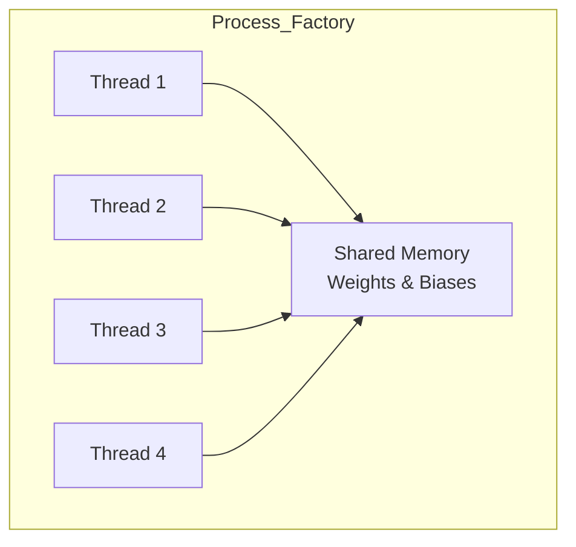
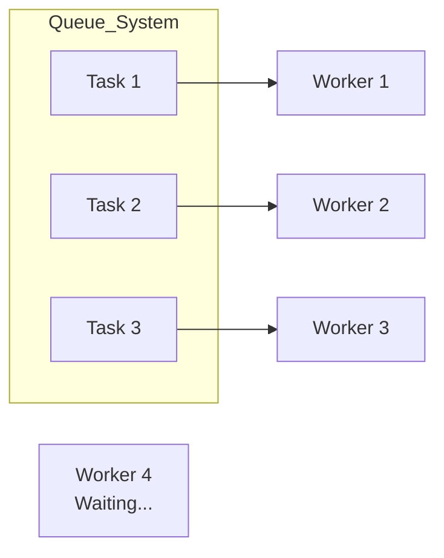

# Chapter 8: Multithreading in C — Using All the "Brains"

In the last chapter, we made our AI **8 times faster** with SIMD. Now, we're going to make it even faster by using **all the CPU cores** in your computer.

---

## 8.1 Processes vs. Threads: What's the Difference?

Imagine you have a big factory.
*   **Process:** The entire building. Each process has its own address and its own equipment.
*   **Thread:** A worker inside that factory. All the workers share the same equipment and the same storage.



### Why use Threads?
Because creating a new building (Process) is very slow and expensive. But hiring a new worker (Thread) is very quick and cheap.

---

## 8.2 The Pthread Library: Hiring Workers

In C, we use a library called **Pthreads** (POSIX Threads). It’s the standard way to create workers in Linux and Mac.

```c
// How to hire a worker (Thread):
pthread_t worker;
pthread_create(&worker, NULL, job_function, data);
```

### Joining the Workers
When you hire workers, you must wait for them to finish before you can ship the product. This is called **Joining**.

```c
pthread_join(worker, NULL);
```

---

## 8.3 Race Conditions: The "Shared Counter" Problem

What happens if two workers try to update the same number at the exact same time?
*   Worker 1: Reads "100", adds 1, writes "101".
*   Worker 2: Reads "100" (at the same time), adds 1, writes "101".
*   **Result:** The counter says **101**, but it should be **102**!

This is a **Race Condition**. It's the most common and dangerous bug in multithreading.

### The Fix: Mutexes (The "Bathroom Key")
A **Mutex** is like a single bathroom key in a coffee shop. If you want to use the bathroom, you have to take the key. No one else can get in until you return the key.

```c
pthread_mutex_lock(&my_key);
// Update the counter safely here
pthread_mutex_unlock(&my_key);
```

---

## 8.4 Thread Pools: The "Ready Workers" Pattern

Creating and firing threads over and over again is wasteful. Instead, we use a **Thread Pool**.

Think of a pizza shop. Instead of hiring a delivery driver every time someone orders a pizza, you keep 4 drivers on staff who are always "ready" to go.



### Our Work Queue
We use a **Condition Variable** to tell our workers when there's a new task.
*   If there's no task, the workers "sleep" and don't use any CPU.
*   When a task arrives, we "signal" a worker to wake up and get to work.

---

## 8.5 Amdahl's Law: The Limit of Speed

If you have 100 workers, will your program be 100 times faster? **No.**

Imagine you have to build a house:
*   90% of the work (painting, brick-laying) can be done by many people at once.
*   10% of the work (laying the foundation) must be done by only one person first.

Even if you have a million workers, you still have to wait for that 10% to finish. This is **Amdahl's Law**. It means your AI can only be as fast as its "slowest" (serial) parts.

---

## 8.6 False Sharing: The "Same Seat" Problem

Modern CPUs store data in **Cache Lines** (blocks of 64 bytes). If two threads are working on two different numbers that are right next to each other, they might accidentally fight over the same "Cache Line."

### The "Bench" Analogy
Imagine two workers are sitting on the same 3-foot bench. Every time one moves, they bump the other. To avoid this, we use **Padding** to make sure our workers have their own "benches" (separate cache lines).

---

## Summary

- **Threads** are lightweight workers that share the same memory.
- **Race Conditions** are bugs where threads step on each other's toes.
- **Mutexes** are "keys" that ensure only one thread can do something at a time.
- **Thread Pools** keep workers "ready" to avoid hiring/firing overhead.
- **Amdahl's Law** reminds us that we can't make everything infinitely fast.
- **False Sharing** happens when threads fight over data that's too close together.

Next, we’ll see how to **Measure and Profile** our AI to find out where to optimize! 🚀
