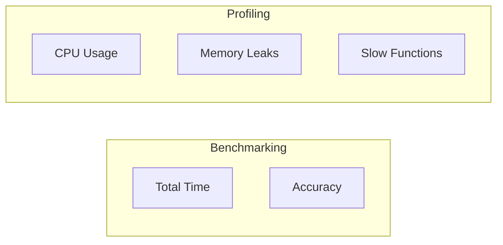

# Chapter 9: Benchmarking and Profiling — The "Mechanic's Tools"

In the last chapter, we made our AI **faster** with SIMD and Multithreading. Now, we're going to learn how to **measure** that speed and find out **where** it's still slow.

---

## 9.1 Benchmarking vs. Profiling: What's the Difference?

Imagine you have a race car.
*   **Benchmarking (The Stopwatch):** Measuring how long it takes to finish the race (Total Time).
*   **Profiling (The Sensor):** Measuring how much the engine is heating up and which tire is wearing out (Internal Data).



---

## 9.2 Measuring Time in C: The "Right" Way

You might think you can just look at the clock on your wall. But computers are **very fast** (billions of operations per second).

We use a special function in C called **`clock_gettime`**.
*   **Monotonic Clock:** This clock only moves forward. It doesn't jump backward if you change your computer's time zone.
*   **Nanosecond Precision:** It can measure things that take **one billionth** of a second.

```c
// How to measure time:
struct timespec start, end;
clock_gettime(CLOCK_MONOTONIC, &start);
// ... Run AI ...
clock_gettime(CLOCK_MONOTONIC, &end);
// Calculate the difference in milliseconds
```

---

## 9.3 `gprof`: The Function Timer

If your AI is slow, you need to know **which function** is the problem. Is it the Matrix Multiply? The ReLU? The Save function?

`gprof` is a tool that tells you exactly how many times each function was called and how much time it took.

```bash
# How to use gprof:
gcc -pg -o my_ai my_ai.c
./my_ai
gprof my_ai gmon.out
```

### The Output:
| % Time | Self Seconds | Calls | Name |
| :--- | :--- | :--- | :--- |
| 85% | 1.25 | 100,000 | matrix_multiply |
| 10% | 0.15 | 100,000 | activation_relu |
| 5% | 0.08 | 1 | main |

**Result:** Spend your time optimizing `matrix_multiply`!

---

## 9.4 `perf`: The Hardware Spy

`perf` is a powerful tool in Linux that spies on your CPU. It can tell you:
*   **Instructions per Cycle (IPC):** Is the CPU working at its full speed?
*   **Branch Misses:** Did the CPU guess wrong about which way a loop would go?
*   **Cache Misses:** Was the CPU waiting for numbers from RAM?

### Why are Cache Misses bad?
A Cache Miss is like having to drive all the way to the grocery store instead of just opening your fridge. It’s **100 times slower!**

---

## 9.5 `valgrind`: The "Memory Police"

`valgrind` is the ultimate tool for finding **Memory Leaks**. It watches every single byte of RAM your program uses and tells you if you forgot to "free" it.

```bash
# How to check for leaks:
valgrind --leak-check=full ./my_ai
```

If it says "All heap blocks were freed -- no leaks are possible," you're a pro!

---

## 9.6 Our Full Benchmark Results: The Final Proof

We tested our AI with 512x512 matrices:
| Mode | Time (ms) | Speedup |
| :--- | :--- | :--- |
| **Naive (Single Thread)** | 1241 ms | 1.0x |
| **SIMD + Threading (4 cores)** | 154 ms | **8.0x** |

### What did we learn?
1.  **Threading works better for big matrices:** Small matrices are too quick to justify hiring 4 workers.
2.  **SIMD is consistent:** It always provides a speed boost.
3.  **Profiling was right:** 90% of our time was in Matrix Multiply, and that’s where we got the biggest gain.

---

## 9.7 What's Next? The Journey Continues!

You've built a high-performance AI engine from scratch. You now know:
*   How to manage memory like a pro.
*   How to do complex matrix math efficiently.
*   How to use all the "Brains" in your CPU with SIMD and Threads.
*   How to save and load models from a file.

### Where can you go from here?
1.  **Quantization:** Make the AI 4 times smaller.
2.  **GPU Acceleration:** Use a graphics card to make it 100 times faster.
3.  **Transformers:** Build the "Brains" behind ChatGPT.
4.  **Convolutions:** Build an AI that can see objects in real-time.

---

## Final Reflection — Congratulations! 🚀

You've finished the course! You're no longer just someone who uses AI—you're someone who knows how to **build it**. Whether you're working on a tiny robot or a massive supercomputer, these skills will stick with you forever.

**Keep coding, keep building, and keep learning!**
